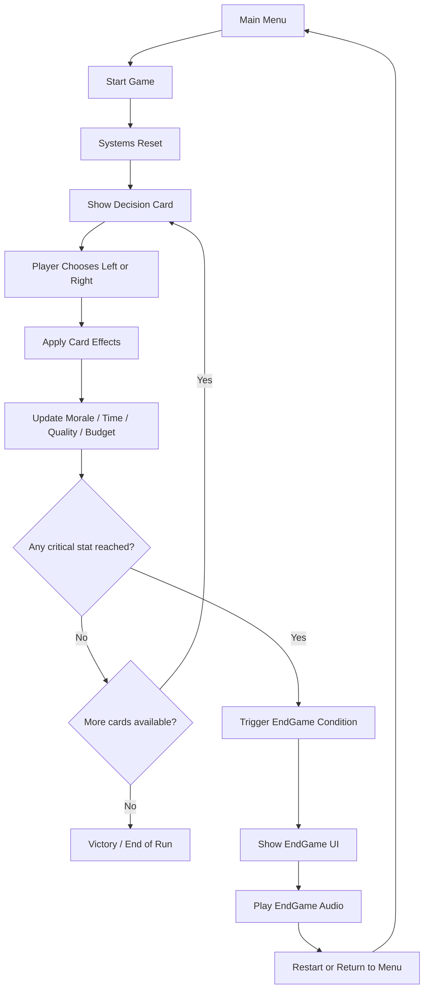
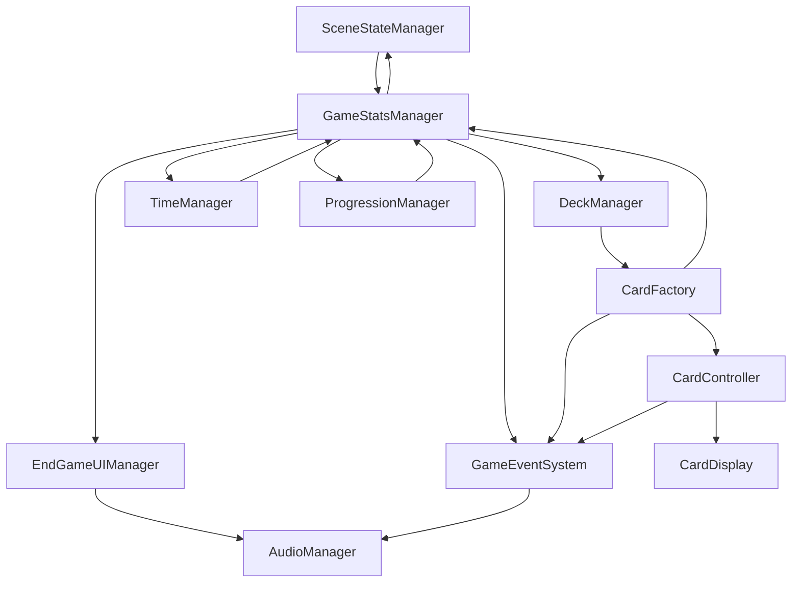
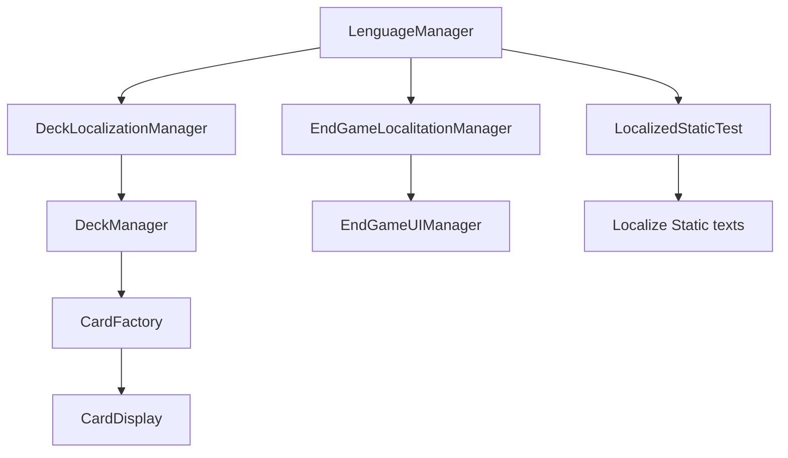

# The Human Loop – A Game About Shipping Decisions


Final Master's Project – AI Development Program
BIG School

---

# Gameplay Preview


A short gameplay preview showing the core decision mechanic where each card choice affects the development metrics of the studio.

---

# Technologies Used

* Unity
* C#
* DOTween
* ScriptableObjects
* Git / GitHub

---

# Overview

**The Human Loop** is a decision-based card game where the player takes the role of a developer managing a small game studio.

Each decision affects four critical project resources:

* Morale
* Time
* Quality
* Budget

The player must balance these resources while navigating the unpredictable realities of game development.

The goal is simple: **ship the game before the project collapses**.

---

# _TheHumanLoop Project Structure (basics)

```

Assets
└── _TheHumanLoop
|   ├── Art
|   │   ├── Audio
|   │   └── Graphics
|   ├── Core
|   │   ├── Data
|   │   ├── Prefabs
│   │   └── Scripts
|   |       ├── Core_Scripts
|   |       ├── Enums
|   |       ├── ScriptableObjects
|   |       |    ├── CardCategorySettingsSO
|   |       |    |    └── Editor
|   |       |    ├── CardDataSO
|   |       |    ├── DeckSO
|   |       |    └── EndGameConditions
|   |       └── UI_Scripts
|   ├── Materials  
|   ├── ModularSystems
|   |   ├── AudioSystem
|   |   ├── GameEventSystem_NP
|   |   └── LocalizationSystem
|   ├── Scenes
|   └── Tools
|       ├── CardCSVImporterTool
|            └── Editor
|       ├── CheatMenu
|            └── Editor
|       ├── Debug
|       ├── DeckBuilderWindowTool
|            └── Editor
|       ├── PlayerPrefsEditor
|            └── Editor
|       └── SceneCleanupManager
├── Resources
├── Decks
└── EndGameConditions
├── Settings
└── TextMesh Pro
```

---

# Gameplay

The gameplay is based on a **card decision system**.

Each card represents an event during development.

The player must choose between two possible decisions:

* Swipe Left → Option A
* Swipe Right → Option B

Each option affects one or more development metrics.

If any metric reaches a critical threshold, the project fails and an **End Game event** occurs.

Possible failures include:

* Budget collapse
* Team morale breakdown
* Time deadline missed
* Quality falling below acceptable levels

---

# Gameplay Loop

The core gameplay loop is based on repeated decision making under resource constraints.



---

# Technical Architecture

The project is built using a **modular architecture** where each system has a specific responsibility.

A central controller manages the lifecycle of the game.

---

## Architecture Diagram



---


# Core Systems

### SceneStateManager

Central controller responsible for:

* Managing game lifecycle
* Resetting systems between runs
* Maintaining the single-scene architecture

---

### DecisionManager

Handles:

* Card presentation
* Player decision input
* Applying gameplay effects

---

### GameStatsManager

Tracks the core project metrics:

* Morale
* Time
* Quality
* Budget

---

### ProgressionManager

Controls deck progression and determines which cards appear during gameplay.

---

### TimeManager

Simulates the progression of the development timeline.

---

### UI System

Responsible for:

* Card display
* Menu navigation
* End game presentation
* Options menu

# Canvas.enabled pattern across all UI systems.

- SceneStateManager: Canvas.enabled for MainMenu/GameScene (remove fade coroutines)
- EndGameUIHandler: Canvas.enabled for EndGamePanel/Title
- CardDisplay: Canvas.enabled for Visuals (remove DOTween fade)
- CardController: Add CanvasGroup + Graphic Raycaster for drag events
- Remove GameOverUIHandler (functionality integrated into EndGameUIHandler) 

---

### AudioManager

Handles playback of **SoundEventSO** audio events and manages the game's sound feedback.

---

# UI System

The card interface uses a **shader-based flip system**.

The shader automatically determines whether the card front or back should be visible based on the card's rotation.

UI visibility is handled using **Canvas** enabling/disabling to avoid to rerenderer the elements again and again.

Benefits:

* Reduced UI lifecycle overhead
* Improved animation stability
* Lower risk of memory glitches

---

# Audio System

Audio events are defined using **ScriptableObject-based SoundEventSO assets**.

The **AudioManager** handles playback.

EndGame audio events are triggered directly from the **EndGameUIHandler**, simplifying the event flow and keeping audio feedback close to the UI presentation layer.

---

# Localization

The project implements a **hybrid localization architecture**.

Dynamic content:

* Cards
* EndGameConditions

These use localized ScriptableObject variants.

Static UI text is translated using a **ScriptableObject localization table**.

Supported languages:

* English
* Spanish



Documentation can be found in:

```
Assets/_TheHumanLoop/ModularSystems/LocalizationSystem
```

---

# AI-Assisted Development

Artificial intelligence tools were used during the development workflow.

### Development Assistance

AI tools assisted with:

* Programming support
* Debugging
* Architectural planning

These tools accelerated development while the final implementation remained under the developer's control.

---

### Visual Content

All visual assets were generated by the developer using **Midjourney**.

Images were later refined and edited using **Affinity** to fit the visual identity of the game.

---

### Music and Audio

The background music used in the game was generated by the developer using **Gemini**.

---

### Creative Direction

The game design, system architecture, gameplay mechanics, and final implementation were entirely directed and executed by the developer.

AI tools were used as **creative and technical assistants**, not as replacements for human design decisions.

---

# Screenshots

### Main Menu


The main menu allows the player to start a new run, access the options menu, and change the language.

---

### Decision Cards


Cards represent events occurring during development.

Each decision affects the project's core metrics.

---

### Gameplay Metrics


The player must balance:

* Morale
* Time
* Quality
* Budget

---

### End Game Screen


Different failure conditions trigger specific end game events.

---

# Development Challenges & Solutions

During development several technical challenges emerged.

---

## Memory Stability

Repeated gameplay loops revealed increasing memory usage.

The architecture was refactored to adopt a **Single Scene Architecture**.

Benefits:

* Prevents duplicate system initialization
* Reduces memory fragmentation
* Simplifies lifecycle management

---

## UI Lifecycle Optimization

UI visibility is handled using **Canvas** enabling/disabling to avoid to rerenderer the elements again and again.

```
SceneStateManager (Root Controller)
├── MainMenu Canvas ← Canvas.enabled
├── GameScene Canvas ← Canvas.enabled
│   ├── Cards (CardDisplay) ← Canvas.enabled
│   ├── Stats UI (StatsViewManager) ← Direct update
│   ├── Time UI (TimeViewManager) ← Direct update
│   └── EndGame UI (EndGameUIHandler) ← Canvas.enabled
└── Fade Overlay ← Optional transition
```

---

## Card Rendering

The card display system was redesigned to use a **shader-based flip mechanism**.

This simplified the rendering logic and reduced UI complexity.

---

## Localization Architecture

Localization was implemented using **ScriptableObject-driven assets**, separating gameplay content from translation data.

---

## Audio Event Simplification

EndGame audio events were moved directly into the **EndGameUIHandler**, removing unnecessary GameEvent layers.

---

# Current Status

The project has reached a **stable MVP version for Windows**.

Core gameplay loop implemented:

Main Menu → Gameplay → End Game → Restart

---

# Future Work

Possible future improvements include:

* WebGL optimization
* Android version
* Additional card decks
* Expanded localization
* Additional gameplay events

---

# License

This project was developed as part of the Final Master's Project for the **AI Development Program at BIG School**.
